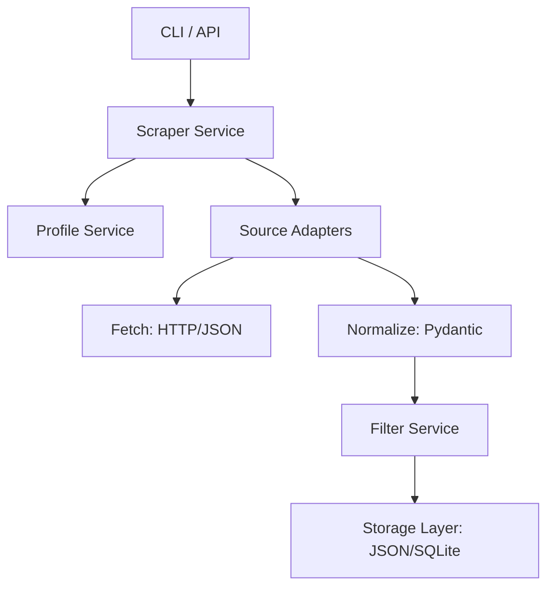

# 🕷️ Arachne

**Arachne** is a high-performance, asynchronous job scraping aggregator designed for tracking listings across major tech companies. It fetches, normalizes, and filters job postings from multiple provider APIs concurrently, providing a unified view of the tech job market.

---

## 🚀 Features

- **Concurrent Execution:** Powered by `asyncio` and `httpx` for high-throughput scraping.
- **Unified Schema:** Normalizes heterogeneous API responses into a strict `JobPosting` Pydantic model.
- **Profile-Based Filtering:** Decouples search criteria (keywords, location, remote) from provider-specific implementation details.
- **Deep Observability:** Isolated per-source logging to debug individual scrapers without noise.
- **Extensible Architecture:** Simple adapter pattern for adding new job sources in minutes.

---

## 🛠️ Installation

### 1. Install `uv` (Recommended)
Arachne uses `uv` for lightning-fast dependency management and project isolation.

**macOS/Linux:**
```bash
curl -LsSf https://astral.sh/uv/install.sh | sh
```

**Windows:**
```powershell
powershell -c "ir https://astral.sh/uv/install.ps1 | iex"
```

### 2. Setup Project
Clone the repository and sync dependencies:

```bash
git clone https://github.com/your-repo/arachne.git
cd arachne
uv sync
```

---

## 📖 Quick Start

### Run a Scrape
Execute the default search profile across all enabled sources:
```bash
uv run arachne run
```

### View Results
List a summary of the latest scraped jobs from the CLI:
```bash
uv run arachne jobs
```

### List Profiles
See all available search configurations:
```bash
uv run arachne profiles
```

---

## 🏗️ Architecture

Arachne is built on a modular "Service-Adapter" architecture:

1.  **CLI/Entrypoint (`cli.py`):** Bootstraps the environment and orchestrates the services.
2.  **Scraper Service:** Coordinates the `asyncio` event loop and manages concurrency limits.
3.  **Source Adapters:** Provider-specific modules that handle the "Fetch" (network) and "Normalize" (data mapping) phases.
4.  **Filter Service:** Applies search profiles (keywords, remote status, etc.) to the normalized data.
5.  **Storage Layer:** Pluggable interface for persisting data (currently defaults to JSON snapshots).



---

## ⚙️ Configuration

-   **`config/global.yaml`**: System-wide settings (concurrency, timeouts, logging levels).
-   **`config/sources.yaml`**: Registry of supported companies and their base API endpoints.
-   **`profiles/*.yaml`**: Definitions of *what* to search for (e.g., "Software Engineer", "Remote", "London").

---

## 🔌 Extending: Adding a New Source

To add a new company:
1.  Create a directory in `src/arachne/sources/<company_name>/`.
2.  Implement a `Source` class inheriting from `arachne.sources.base.Source`.
3.  Define the `fetch` (API call) and `normalize` (mapping to `JobPosting`) methods.
4.  Register the source in `config/sources.yaml`.

*See [src/arachne/sources/README.md](src/arachne/sources/README.md) for a detailed guide.*

---

## 🗺️ Roadmap

- [ ] **API Layer:** FastAPI-based backend to expose scraping triggers and data.
- [ ] **Web UI:** Interactive dashboard for viewing jobs and managing profiles.
- [ ] **Persistent Database:** Transition from JSON snapshots to a relational database (SQLite/PostgreSQL).

---

## 📜 License
This project is licensed under the MIT License.
